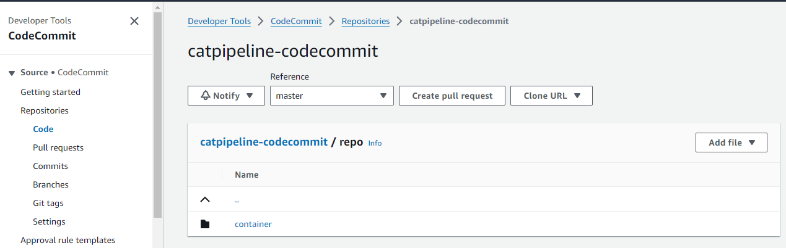

# Stage 1 - Code Commit

In this segment of the advanced demonstration, you will establish and configure a CodeCommit repository while setting up access from your local machine.

## Generating an SSH Key for CodeCommit Authentication

Refer to the official instructions for Linux and macOS [here](https://docs.aws.amazon.com/codecommit/latest/userguide/setting-up-ssh-unixes.html) and for Windows [here](https://docs.aws.amazon.com/codecommit/latest/userguide/setting-up-ssh-windows.html).

1. Open your terminal and run the following commands:
    ```bash
    cd ~/.ssh
    ssh-keygen -t rsa -b 4096
    ```

2. Name the key 'codecommit' and omit setting a password.
3. Display the public key:
    ```bash
    cat ~/.ssh/codecommit.pub
    ```
4. Copy the output to your clipboard.

5. In the AWS console, navigate to the IAM console [here](https://us-east-1.console.aws.amazon.com/iamv2/home?region=us-east-1#/home).
6. Open the user 'iamadmin' (whatever the user is in your account) under Users and go to the `Security Credentials` tab.
7. In the AWS CodeCommit section, upload an SSH key and paste the clipboard contents.
8. Note the `SSH key id`.

9. From your terminal, run `nano ~/.ssh/config` and add the following at the top:
    ```
    Host git-codecommit.*.amazonaws.com
      User KEY_ID_YOU_COPIED_ABOVE_REPLACEME
      IdentityFile ~/.ssh/codecommit
    ```
10. Replace `KEY_ID_YOU_COPIED_ABOVE_REPLACEME` with the SSH key ID you copied.
11. Save the file and run `chmod 600 ~/.ssh/config` for correct permissions.

12. Test with:
    ```bash
    ssh git-codecommit.us-east-1.amazonaws.com
    ```
    If successful, you should see:
    ```
    You have successfully authenticated over SSH. You can use Git to interact with AWS CodeCommit. Interactive shells are not supported. Connection to git-codecommit.us-east-1.amazonaws.com closed by remote host.
    ```

## Creating CodeCommit Repository for Cat Pipeline

1. Visit the CodeCommit console [here](https://us-east-1.console.aws.amazon.com/codesuite/codecommit/repositories?region=us-east-1).
2. Create a repository named `catpipeline-codecommit`.
3. After creation, find connection steps details, click `SSH`, and note the `Clone the repository` command.

4. In your terminal, navigate to the desired repo folder (e.g., `mkdir ~/repo` and `cd ~/repo`).
5. Run the clone command (e.g., `ssh://git-codecommit.us-east-1.amazonaws.com/v1/repos/catpipeline-codecommit-XXX`).

## Adding Demo Code

1. Download [container.zip](https://github.com/acantril/learn-cantrill-io-labs/raw/master/aws-codepipeline-catpipeline/01_LABSETUP/container.zip).
2. Copy the ZIP into the repo folder, extract it, and delete the ZIP file.

3. In the terminal, navigate to the folder and run:
    ```bash
    git add -A .
    git commit -m "container of cats"
    git push --set-upstream ssh://git-codecommit.us-east-1.amazonaws.com/v1/repos/catpipeline-codecommit master

    ```

You now have a CodeCommit repo with code, ready for the next step. Before proceeding, familiarize yourself with Elastic Container Repo (ECR), as it will be used to store a Docker image created from this source. If you're using this text-only version, conduct your own ECR research or ensure you're already acquainted with ECR.


