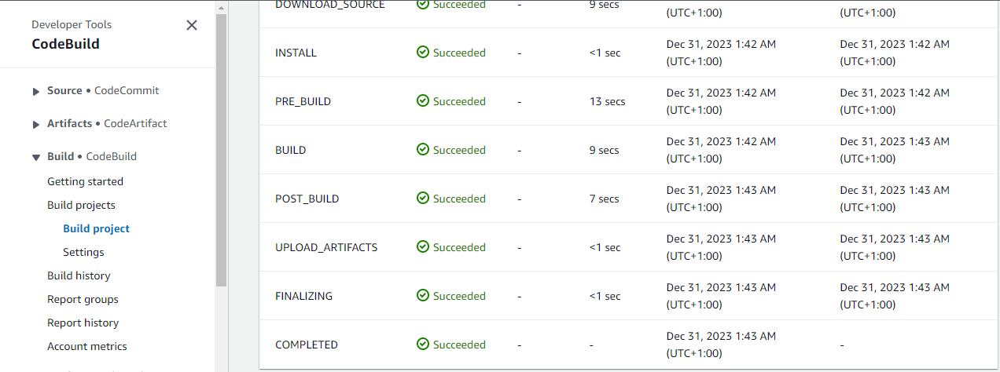
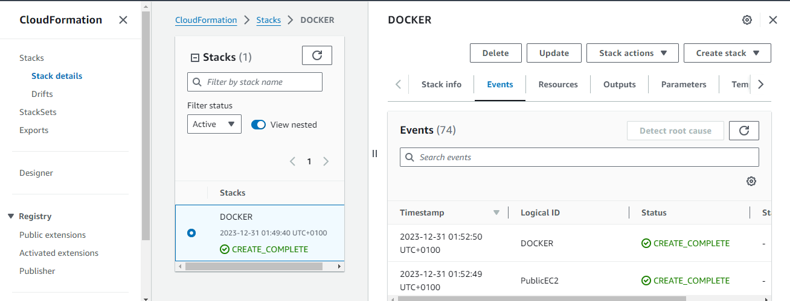
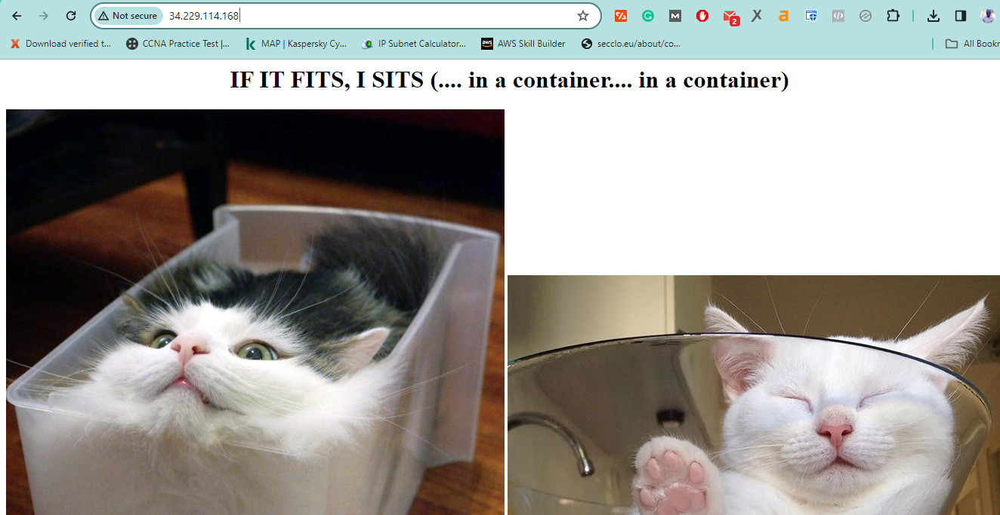

# Stage 2 - Code Build

Welcome to Stage 2 of this demonstration, where you will configure the Elastic Container Registry (ECR) and utilize the AWS CodeBuild service to build a Docker container and push it to the registry.

## Create a Private Repository

1. Navigate to the Container Services console: [ECR Repositories](https://us-east-1.console.aws.amazon.com/ecr/repositories?region=us-east-1).
2. Create a private repository with the alias/name 'catpipeline.'
3. Note down the repository URL and name (matching the specified alias).

This repository is where CodeBuild will store the Docker image created from the CodeCommit repository.

## Set Up a CodeBuild Project

Move to the CodeBuild console: [CodeBuild Projects](https://us-east-1.console.aws.amazon.com/codesuite/codebuild/projects?region=us-east-1).

### Project Configuration

- **Project name:** `catpipeline-build`.
- Leave other options in this section as default.

### Source

- **Source Provider:** AWS CodeCommit.
- **Repository:** Choose the repository created in Stage 1.
- Check the `Branch` checkbox and select the branch from the dropdown.

### Environment

- **Environment image:** Managed Image.
- **Operating system:** Amazon Linux.
- **Runtime(s):** Standard.
- **Image:** `aws/codebuild/amazonlinux2-x86_64-standard:X.0` (replace X with the highest number).
- **Image version:** `Always use the latest image for this runtime version`.
- **Environment Type:** Linux.
- Check the `Privileged` box (required for Docker image creation).
- **Service role:** New Service Role (default suggested name: `codebuild-catpipeline-service-role`).
- Expand `Additional Configuration` and add the following environment variables:

  ```
  AWS_DEFAULT_REGION with a value of us-east-1
  AWS_ACCOUNT_ID with a value of your AWS_ACCOUNT_ID_REPLACEME
  IMAGE_TAG with a value of latest
  IMAGE_REPO_NAME with a value of your ECR_REPO_NAME_REPLACEME
  ```

### Buildspec

- Check `Use a buildspec file`.
- (Optional) Specify a different name or location for the buildspec file.

### Artifacts

No changes needed for this section, as testing is not implemented yet.

### Logs

Configure logging to CloudWatch logs or S3 (optional).

- **Groupname:** `cat-codebuild`.
- **Stream Name:** `catpipeline`.

Create the build project.

## Build Security and Permissions

Ensure the build project has the necessary permissions to access ECR. Update the IAM role created by CodeBuild with the following inline policy:

```json
{
  "Statement": [
    {
      "Action": [
        "ecr:BatchCheckLayerAvailability",
        "ecr:CompleteLayerUpload",
        "ecr:GetAuthorizationToken",
        "ecr:InitiateLayerUpload",
        "ecr:PutImage",
        "ecr:UploadLayerPart"
      ],
      "Resource": "*",
      "Effect": "Allow"
    }
  ],
  "Version": "2012-10-17"
}
```

Review the policy, name it `Codebuild-ECR`, and create the policy.

## Buildspec.yml

Create a file in the local copy of the `catpipeline-codecommit` repo called `buildspec.yml`. Add the following contents:

```yaml
version: 0.2

phases:
  pre_build:
    commands:
      - echo Logging in to Amazon ECR...
      - aws ecr get-login-password --region $AWS_DEFAULT_REGION | docker login --username AWS --password-stdin $AWS_ACCOUNT_ID.dkr.ecr.$AWS_DEFAULT_REGION.amazonaws.com
  build:
    commands:
      - echo Build started on `date`
      - echo Building the Docker image...
      - docker build -t $IMAGE_REPO_NAME:$IMAGE_TAG ./repo/container/.
      - docker tag $IMAGE_REPO_NAME:$IMAGE_TAG $AWS_ACCOUNT_ID.dkr.ecr.$AWS_DEFAULT_REGION.amazonaws.com/$IMAGE_REPO_NAME:$IMAGE_TAG
  post_build:
    commands:
      - echo Build completed on `date`
      - echo Pushing the Docker image...
      - docker push $AWS_ACCOUNT_ID.dkr.ecr.$AWS_DEFAULT_REGION.amazonaws.com/$IMAGE_REPO_NAME:$IMAGE_TAG
```

Add, commit, and push the changes locally.

```bash
git add -A .
git commit -m "Add buildspec.yml"
git push
```

## Test the CodeBuild Project

1. Open the CodeBuild console: [CodeBuild Projects](https://us-east-1.console.aws.amazon.com/codesuite/codebuild/projects?region=us-east-1).
2. Open `catpipeline-build`.
3. Start the build.
4. Check progress under the `Phase Details` and `Build Logs` tabs.




## Test the Docker Image

Follow the instructions [here](https://console.aws.amazon.com/cloudformation/home?region=us-east-1#/stacks/quickcreate?templateURL=https://techidence.s3.amazonaws.com/aws_projects/ec2docker.yaml&stackName=DOCKER) to deploy an EC2 instance with Docker installed.

1. Wait for the stack to reach `CREATE_COMPLETE`.




2. Open the EC2 Console: [EC2 Instances](https://us-east-1.console.aws.amazon.com/ec2/home?region=us-east-1#Home:).
3. Select `A4L-PublicEC2`, right-click, and connect using EC2 Instance Connect.
4. Test Docker via the `docker ps` command; it should output an empty list.
5. Run the following commands, replacing placeholders:

   ```bash
   aws ecr get-login-password --region us-east-1 | docker login --username AWS --password-stdin ACCOUNTID_REPLACEME.dkr.ecr.us-east-1.amazonaws.com
   docker pull ACCOUNTID_REPLACEME.dkr.ecr.us-east-1.amazonaws.com/catpipeline:latest
   docker run -p 80:80 IMAGEID_REPLACEME
   ```

6. Open the public IPv4 address in a browser (http://IP) to view the running Docker container with cats.




If successful, your automated build process is functioning as intended.