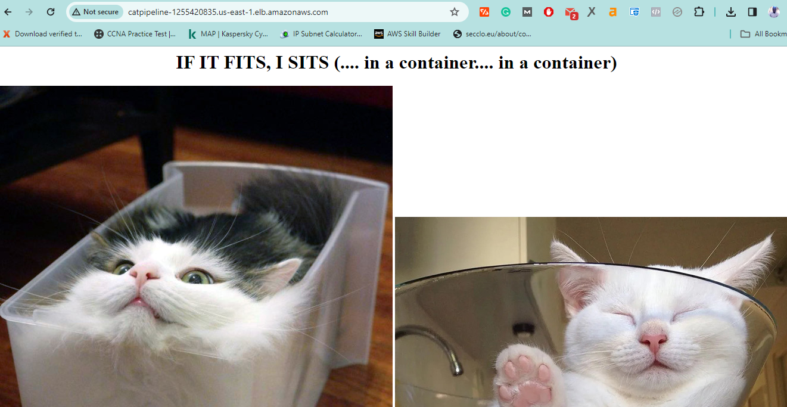
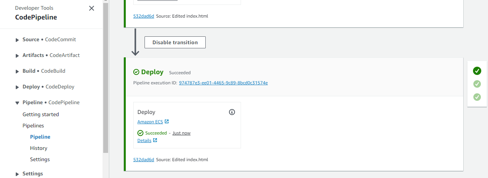
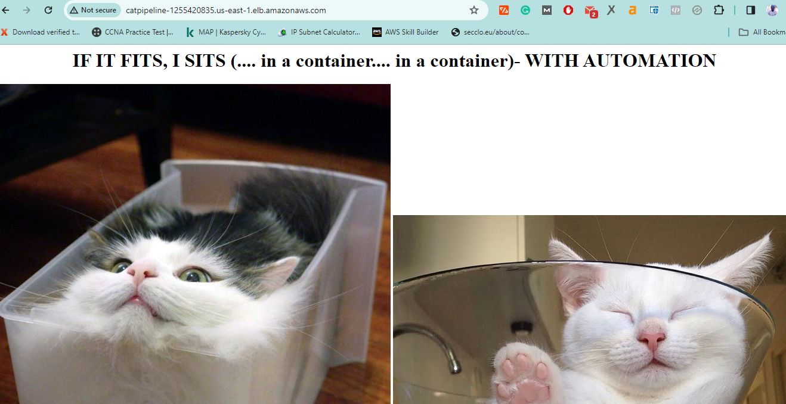

# STAGE 4 - AUTOMATED CODE DEPLOYMENT

This stage focuses on configuring the automated deployment of the Cat Pipeline application to Amazon Elastic Container Service (ECS) Fargate.

## Load Balancer Configuration

1. Navigate to the [EC2 Console](https://us-east-1.console.aws.amazon.com/ec2/v2/home?region=us-east-1#Home:) and proceed to Load Balancing -> Load Balancers -> Create Load Balancer.
2. Create an application load balancer named `catpipeline`.
3. Configure it as Internet Facing with IPv4.
4. For network, select your default VPC and include all subnets.
5. Create a new security group named `catpipeline-SG` with an inbound rule for HTTP (source IP address: 0.0.0.0/0).
6. Return to the original tab, select `catpipeline-SG` from the security group dropdown, and remove the default security group.
7. Ensure that HTTP:80 is configured for the listener under 'Listeners and Routing.'
8. Create a target group named `catpipelineA-TG` with IP, HTTP:80, HTTP1, and the default VPC selected.
9. Proceed with creating the load balancer, allowing it a few minutes to initialize.

## Fargate Cluster Configuration

1. Move to the [ECS Console](https://us-east-1.console.aws.amazon.com/ecs/home?region=us-east-1#/getStarted) and create a cluster named `allthecatapps` using the default VPC.
2. Ensure all subnets in the VPC are listed and proceed to create the cluster.

## Task and Container Definitions

1. Navigate to the [ECS Cluster](https://us-east-1.console.aws.amazon.com/ecs/home?region=us-east-1#/clusters) and move to `Task Definitions` to create a task definition named `catpipelinedemo`.
2. In `Container Details`, name the container `catpipeline` and input the Image URI from the ECR console.
3. Specify the operating system family as `Linux/X86_64`.
4. Set task resources to `0.5vCPU` for CPU and `1GB` for memory.
5. Select `ecsTaskExecutionRole` for both task role and task execution role.
6. Complete the creation process.

## Deploy to ECS - Create a Service

1. Click "Deploy" then select `Create Service`.
2. Choose `FARGATE` as the launch type and name the service `catpipelineservice`.
3. Set desired tasks to 2 and choose `rolling update` for deployment type under `Deployment Options`.
4. Configure networking, security group, public IP, load balancer type, and related settings.
	-	for `VPC` pick the default VPC
	-	for `Subnets` make sure all subnets are selected.  
	-	for `Security Group`, choose `User Existing Security Group` and ensure that `Default` and `catpipeline-SG` are selected.  
	-	or `public IP` choose `Turned On`  
	-	for `Load Balancer Type` pick `Application Load Balancer`
	-	for `Load balancer name` pick `catpipeline`  
	-	for `container to load balance` select 'catpipeline:80:80'  
	-	select `Use an existing Listener` select `80:HTTP` from the dropdown
	-	for choose `Use an existing target group` and for `Target group name` pick `catpipelineA-TG` 
	-	Expand `Service auto scaling` and make sure it's **not** selected.  

5. Create the service and wait for deployment completion.

## Testing the Deployment

1. Move to the [Load Balancer Console](https://us-east-1.console.aws.amazon.com/ec2/v2/home?region=us-east-1#LoadBalancers) and select the `catpipeline` load balancer.
2. Copy the `DNS name` and open it in a browser using http:// (not https://).
3. Confirm that the containerized Cats website is displayed.




## Adding a Deploy Stage to the Pipeline

1. Visit the [CodePipeline Console](https://us-east-1.console.aws.amazon.com/codesuite/codepipeline/pipelines?region=us-east-1).
2. Click on `catpipeline` and then select `edit`.
3. Add a new stage named `Deploy` and include an action group with the following details:
   - Action name: `Deploy`
   - Action Group: `Amazon ECS`
   - Region: `US East (N.Virginia)`
   - Input artifacts: `Build Artifact` (containing `imagedefinitions.json`)
   - Cluster Name: `allthecatapps`
   - Service Name: `catpipelineservice`
   - Image Definitions file: `imagedefinitions.json`
4. Save and confirm the changes.

## Testing the Deployment Pipeline

1. In the local repository, edit the `index.html` file by adding " - WITH AUTOMATION" to the `h1` line text and save the file.
2. Run the following commands:
    ```bash
    git add -A .
    git commit -m "test pipeline"
    git push
    ```
3. Monitor the progress in the [CodePipeline Console](https://us-east-1.console.aws.amazon.com/codesuite/codepipeline/pipelines/catpipeline/view?region=us-east-1).
4. Ensure each pipeline step completes successfully.




5. Refresh the application open via the load balancer, and observe the updated text.


